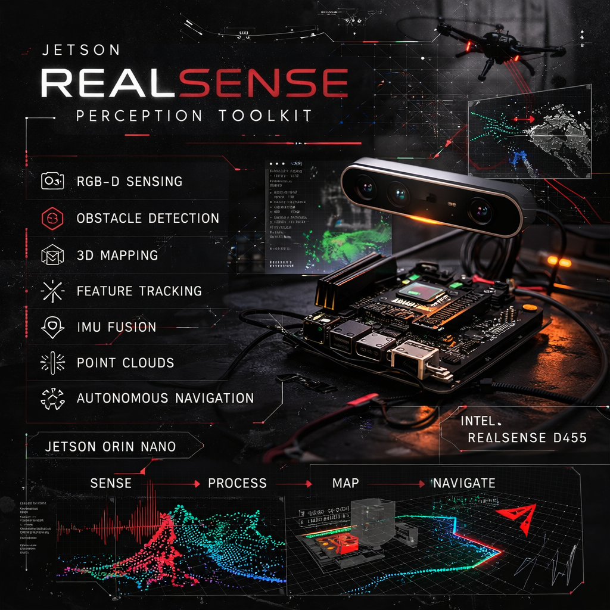

# Jetson RealSense Perception Toolkit



**Embedded RGB-D perception system for robotics using Jetson Orin Nano and Intel RealSense cameras.**

This project demonstrates core perception capabilities used in **autonomous robots and drones**, including:
- RGB-D sensing
- Real-time obstacle detection
- 3D point cloud capture
- Feature tracking
- IMU streaming
- Real-time occupancy grid mapping

The scripts in this repository explore how depth cameras can be used for **robot navigation, environment perception, and 3D mapping**.

---

## Hardware

- NVIDIA Jetson Orin Nano
- Intel RealSense D455 RGB-D Camera

---

## System Architecture

Getting this pipeline running on an embedded GPU system is a system-integration task: sensor → SDK → bindings → your logic → hardware.

```
Intel RealSense D455
        ↓
librealsense SDK
        ↓
pyrealsense2
        ↓
Python perception modules
        ↓
OpenCV / NumPy processing
        ↓
Jetson Orin Nano (embedded system)
```

Perception modules: obstacle detection, point cloud capture, feature tracking, occupancy mapping.

---

## Scripts

### 1. `realsense_view.py` — Basic Viewer

Simple RGB and depth stream viewer. This is the **starting point** for verifying camera operation.

**Usage:**

```bash
python3 realsense_view.py
```

Press `q` to quit.

---

### 2. `obstacle_detector.py` — Navigation Helper

Real-time obstacle detection with distance warnings. A navigation zone in the center of the image is monitored for objects that are too close.

**Usage:**

```bash
python3 obstacle_detector.py
```

**Features:**

- Yellow rectangle shows the monitored navigation zone
- Green text = clear path
- Red text = obstacle detected (< 0.5m)
- Press `q` to quit

---

### 3. `point_cloud_capture.py` — 3D Scanning

Capture 3D point clouds from the camera and save them for later visualization.

**Usage:**

```bash
python3 point_cloud_capture.py
```

**Controls:**

- Press `s` to save the current frame as a point cloud
- Press `q` to quit

Saved scans are stored as: `scan.npz`

---

### 4. `view_scan.py` — Point Cloud Viewer

Visualize saved point cloud scans in 3D.

**Requirements:**

```bash
pip3 install open3d
```

**Usage:**

```bash
python3 view_scan.py [scan_file.npz]
```

If no file is specified, defaults to `scan.npz`.

---

### 5. `simple_tracking.py` — Feature Tracking

Basic visual feature tracking for understanding camera movement. Shows how features are matched between frames.

**Usage:**

```bash
python3 simple_tracking.py
```

- Shows feature matches between consecutive frames
- Prints tracking statistics to console
- Press `q` to quit

---

### 6. `imu_stream.py` — IMU Data Streaming

Stream and visualize accelerometer and gyroscope data from the RealSense camera's built-in IMU.

**Usage:**

```bash
python3 imu_stream.py
```

- Real-time graphs of accelerometer (X, Y, Z) and gyroscope (X, Y, Z) data
- Calculates pitch and roll from accelerometer
- Shows motion magnitude
- Press `s` to save IMU data to file
- Press `q` to quit

**Note:** Requires a RealSense camera with IMU (D435i, D455, etc.)

---

### 7. `radar_mapper.py` — 3D Radar Mapper

Live 3D occupancy grid mapper with radar-style top-down view. Builds a map in real-time as you scan with the camera.

**Usage:**

```bash
python3 radar_mapper.py
```

- **Top-down radar view**: Green dots show occupied space (like a radar sweep)
- **Side view**: X-Z plane visualization
- **Live camera feed**: RGB and depth streams
- **Occupancy grid**: 2cm resolution grid showing free/occupied space
- Press 'c' to clear the map
- Press 's' to save the map
- Press 'q' to quit

**Features:**
- Real-time 3D mapping as you move the camera
