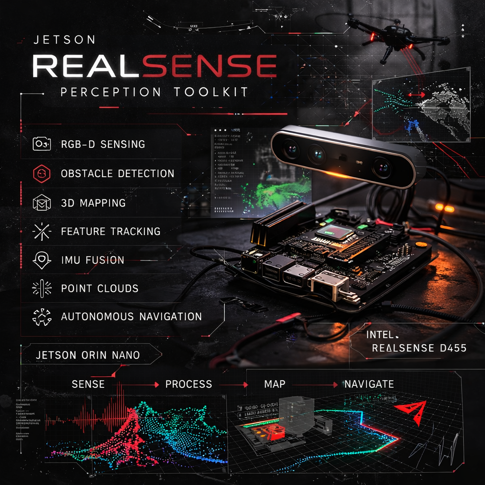

# Jetson RealSense Perception

<p align="center">
  
</p>

<p align="center">
  
</p>

Embedded RGB-D perception toolkit for **NVIDIA Jetson Orin Nano** and **Intel RealSense D455**. Supports standalone Python (pyrealsense2) and ROS2 Humble workflows. Developed and validated on Ubuntu 22.04 / JetPack L4T 36.4.7.

---

## What This Repo Is

- **Standalone scripts** — Direct RealSense access via `pyrealsense2` for streaming, capture, obstacle detection, point clouds, IMU, and occupancy-style mapping.
- **ROS2 integration** — Validation scripts and utilities for the [RealSense ROS2 wrapper](https://github.com/realsenseai/realsense-ros); launch and sanity checks.
- **Documentation** — Hardware/software setup, ROS2 setup, troubleshooting, and a validation checklist so another engineer can reproduce the stack.

---

## Hardware & Software Stack

| Layer | What’s used |
|-------|-------------|
| **Platform** | NVIDIA Jetson Orin Nano, Ubuntu 22.04 (L4T 36.4.7) |
| **Camera** | Intel RealSense D455 RGB-D |
| **SDK** | RealSense SDK 2.0 (librealsense) built from source with **RSUSB backend** |
| **Python** | pyrealsense2, numpy (&lt;2.0), opencv-python; optional open3d |
| **ROS2** | Humble; realsense2_camera node (realsense-ros from [RealSenseAI](https://github.com/realsenseai)) |

---

## What I Validated

- **D455 enumerates** — `/usr/local/bin/rs-enumerate-devices` and `scripts/check_realsense.py` see the camera (name, serial, firmware).
- **Depth + color streaming in Python** — Standalone pyrealsense2 scripts stream and capture; e.g. `realsense_view.py`, `scripts/capture_color_depth.py`.
- **ROS2 node** — `realsense2_camera` launches successfully; topics publish.
- **Topics confirmed:** `/camera/camera/color/image_raw`, `/camera/camera/depth/image_rect_raw`, `/camera/camera/color/camera_info`, `/camera/camera/depth/camera_info`.
- **Camera info** — Color and depth `camera_info` publish with correct intrinsics.

---

## Repo Layout

```
/
  README.md          # This file
  LICENSE
  .gitignore
  requirements.txt
  setup.sh           # Optional: pip install deps
  Makefile           # make check, capture, ros-launch, ros-sanity

  docs/              # Setup and validation
    hardware_setup.md
    software_setup.md
    ros2_setup.md
    troubleshooting.md
    validation.md

  scripts/           # Entry-point and validation scripts
    check_realsense.py      # Verify pyrealsense2 + enumerate device
    capture_color_depth.py  # Save one color + depth frame (headless OK)
    center_depth_probe.py   # Print center (or x,y) depth in meters
    ros_topic_sanity.sh     # Quick ROS2 topic / camera_info check
    save_ros_frames.py      # Subscribe to ROS topics, save one frame each
    launch_realsense_ros.sh # Convenience launcher for rs_launch.py

  src/
    standalone/      # Standalone pyrealsense2 demos (no ROS)
      realsense_view.py
      obstacle_detector.py
      point_cloud_capture.py
      view_scan.py
      simple_tracking.py
      imu_stream.py
      radar_mapper.py
      stream_info.py
    ros2_tools/       # ROS2 helpers
      topic_monitor.py
      frame_info_monitor.py

  ros2/               # ROS2 notes and launch examples
    README.md
    launch/
  assets/
    sample_outputs/   # For saved captures
```

---

## Quick Start

### 1. Verify RealSense (no ROS)

```bash
python3 scripts/check_realsense.py
# Or: /usr/local/bin/rs-enumerate-devices
```

### 2. Run Standalone Scripts (camera must be free)

```bash
# Headless capture (no GUI)
python3 scripts/capture_color_depth.py -o assets/sample_outputs

# Viewer (needs DISPLAY)
python3 src/standalone/realsense_view.py

# Obstacle detector, point cloud, IMU, radar mapper, etc.
python3 src/standalone/obstacle_detector.py
python3 src/standalone/point_cloud_capture.py
python3 src/standalone/imu_stream.py --no-gui   # headless
```

### 3. Launch ROS2 RealSense Node

Stop any standalone script using the camera first. Then:

```bash
source /opt/ros/humble/setup.bash
source ~/ros2_ws/install/setup.bash   # if your workspace is there
ros2 launch realsense2_camera rs_launch.py
```

Or use the convenience script (if paths match):

```bash
./scripts/launch_realsense_ros.sh
```

### 4. Validate ROS2 Topics

In another terminal (with same sourcing):

```bash
ros2 topic list | grep camera
ros2 topic echo /camera/camera/color/camera_info --once
bash scripts/ros_topic_sanity.sh
```

### 5. Save Frames from ROS (headless)

With the ROS node running:

```bash
python3 scripts/save_ros_frames.py -o assets/sample_outputs
```

---

## ROS2 Workflow

This repo supports two complementary workflows:

### 1. Standalone SDK validation
Use standalone Python scripts when validating hardware, SDK installation, and direct frame capture.

```bash
python3 scripts/check_realsense.py
python3 scripts/capture_color_depth.py
python3 scripts/center_depth_probe.py
```

These scripts verify:
- librealsense is installed
- pyrealsense2 is importable
- D455 is detected
- color and depth frames can be captured

### 2. ROS2 robotics workflow
Use ROS2 when the camera should behave like a robot sensor feeding downstream tools and nodes.

```bash
source /opt/ros/humble/setup.bash
source ~/ros2_ws/install/setup.bash
ros2 launch realsense2_camera rs_launch.py
ros2 topic list | grep camera
ros2 topic hz /camera/camera/color/image_raw
ros2 topic echo /camera/camera/color/camera_info --once
python3 scripts/ros_topic_report.py
python3 src/ros2_tools/rgbd_topic_probe.py
```

This workflow is used for:
- RViz / Foxglove visualization
- ROS topic inspection
- downstream perception nodes
- frame transforms / extrinsics
- logging / rosbag workflows

## Validation Layers

This repo validates the RealSense stack in layers:

1. Hardware / SDK layer
   - `scripts/check_realsense.py`
   - verifies pyrealsense2, device enumeration, firmware visibility, and USB link

2. Direct frame capture layer
   - `scripts/capture_color_depth.py`
   - verifies color + depth streaming through pyrealsense2

3. ROS2 camera driver layer
   - `realsense2_camera` launch
   - verifies camera topics publish correctly through ROS2

4. ROS2 topic validation layer
   - `scripts/ros_topic_sanity.sh`, `scripts/ros_topic_report.py`
   - validates expected topics and camera_info availability

5. Downstream perception layer
   - `src/ros2_tools/rgbd_topic_probe.py` and future nodes
   - consumes published image and depth topics

## Recommended Terminal Layout

For ROS2 workflows, use 2-3 terminals:

### Terminal 1 — Camera Driver

Launch the RealSense ROS2 node:

```bash
ros2 launch realsense2_camera rs_launch.py
```

### Terminal 2 — ROS2 Inspection

Inspect topics, rates, and camera info:

```bash
ros2 topic list | grep camera
ros2 topic hz /camera/camera/color/image_raw
ros2 topic echo /camera/camera/color/camera_info --once
python3 scripts/ros_topic_report.py
```

### Terminal 3 — Visualization (optional)

Use RViz2 or Foxglove on local display or remote client.

## Known ROS2 Notes

- The raw topics are the primary topics to use for robotics workflows:
  - `/camera/camera/color/image_raw`
  - `/camera/camera/color/camera_info`
  - `/camera/camera/depth/image_rect_raw`
  - `/camera/camera/depth/camera_info`
  - `/camera/camera/extrinsics/depth_to_color`

- On some setups, compressed image transport plugins may emit warnings for depth image encodings such as `16UC1`. These warnings do not necessarily indicate failure of the raw color/depth pipeline.

- For robotics and perception development, prefer raw image topics over compressed topics unless bandwidth reduction is specifically required.

## Next ROS2 Perception Step

The next recommended step is to build ROS2 subscriber nodes that consume:
- `/camera/camera/color/image_raw`
- `/camera/camera/depth/image_rect_raw`
- `/camera/camera/color/camera_info`

Examples of useful next nodes:
- center-depth monitor
- frame-saving ROS subscriber
- RGB-D alignment / annotation node
- object detection + depth estimation node

---

## Common Gotchas

- **Headless Jetson** — No DISPLAY means `cv2.imshow()` and rqt viewers fail. Use CLI capture (`scripts/capture_color_depth.py`, `scripts/save_ros_frames.py`) or scripts that support `--no-gui` (e.g. `imu_stream.py --no-gui`).
- **Camera locked** — Only one process can open the RealSense at a time. If the ROS node is running, standalone pyrealsense2 scripts will fail (and vice versa). Stop the other process first.
- **Wrong binary** — Prefer `/usr/local/bin/rs-enumerate-devices` for validation. An older binary under `/opt/ros/humble/bin` can shadow your SDK build.

See [docs/troubleshooting.md](docs/troubleshooting.md) for more.

---

## Docs

| Doc | Purpose |
|-----|---------|
| [docs/hardware_setup.md](docs/hardware_setup.md) | Jetson, D455, USB, headless note |
| [docs/software_setup.md](docs/software_setup.md) | Ubuntu, librealsense from source (RSUSB), pyrealsense2, Python deps |
| [docs/ros2_setup.md](docs/ros2_setup.md) | Workspace, realsense-ros, launch, version matching |
| [docs/troubleshooting.md](docs/troubleshooting.md) | Fixes for common Jetson + RealSense + ROS2 issues |
| [docs/validation.md](docs/validation.md) | Step-by-step validation commands |

---

## Makefile

```bash
make check       # scripts/check_realsense.py
make capture     # capture to assets/sample_outputs
make ros-launch  # launch RealSense ROS node
make ros-sanity  # scripts/ros_topic_sanity.sh (source ROS2 first)
```

---

## Requirements

- **RealSense SDK 2.0 (librealsense)** — Built from source with RSUSB (recommended on this setup). See [docs/software_setup.md](docs/software_setup.md).
- **Python 3** — With `pyrealsense2` (from SDK), `numpy` (&lt;2.0), `opencv-python`. Optional: `open3d` for `view_scan.py`.
- **ROS2 (optional)** — Humble + realsense-ros for ROS2 workflows.

```bash
pip3 install -r requirements.txt
```

---

## Next Steps (Not Yet Implemented)

- Aligned depth–color processing
- Point cloud generation from ROS or standalone
- Obstacle detection as navigation decision output
- Dedicated ROS2 perception nodes
- Logging / rosbag capture

---

## License

MIT. See [LICENSE](LICENSE).
